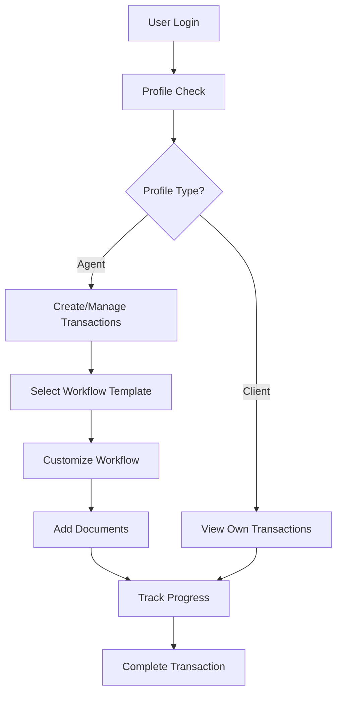

# Entity Relationships

This section maps how all entities relate to each other and which enumerations they use.

## Primary Entity Relationships

### User Management Flow

```
User
└── Profile (ProfileType enum)
    ├── RealEstateAgentProfile
    │   └── Brokerage
    └── ClientProfile
```

### Transaction Processing Flow

```
Transaction (TransactionType, TransactionStatus enums)
├── Property
├── User (Agent)
├── User (Client - optional)
├── Workflow
│   └── Checklist
│       └── Item (ItemStatus enum)
└── Document (DocumentCategory, DocumentStatus enums)
```

### Template System Flow

```
WorkflowTemplate (TransactionType enum)
└── ChecklistTemplate
    └── ItemTemplate

DocumentTemplate (DocumentCategory enum)
```

## Entity-Enumeration Mapping

### TransactionType Enum

**Used by:**

- `Transaction.transactionType` - Defines what kind of transaction this is
- `WorkflowTemplate.transactionType` - Defines which transaction type the template serves

**Values:** PURCHASE, LISTING_FOR_SALE, LISTING_FOR_LEASE, LEASE, OTHER

### TransactionStatus Enum

**Used by:**

- `Transaction.status` - Tracks the overall progress of the transaction

**Values:** IN_PREPARATION, ACTIVE, UNDER_CONTRACT, SOLD_LEASED, TERMINATED, WITHDRAWN

### DocumentStatus Enum

**Used by:**

- `Document.status` - Controls document lifecycle and allowed actions

**Values:** PENDING, READY, WAITING, SIGNED, REJECTED, ARCHIVED

### DocumentCategory Enum

**Used by:**

- `Document.category` - Classifies documents by purpose
- `DocumentTemplate.category` - Classifies templates by document type

**Values:** CONTRACT_AND_NEGOTIATION, TITLE_AND_OWNERSHIP, DISCLOSURE, CLOSING_AND_FINANCING, AGREEMENTS, LISTINGS_AND_MARKETING, PROPERTY_MANAGEMENT, INSURANCE, MISCELLANEOUS

### ItemStatus Enum

**Used by:**

- `Item.status` - Tracks progress of individual tasks

**Values:** NOT_STARTED, IN_PROGRESS, COMPLETED

### ProfileType Enum

**Used by:**

- `Profile.profileType` - Determines user capabilities and permissions

**Values:** CLIENT, REAL_ESTATE_AGENT

## Cross-Entity Relationships

### Many-to-One Relationships

- **Transaction** → **Property** (many transactions can involve the same property over time)
- **Transaction** → **User** (agent - one agent can handle many transactions)
- **Transaction** → **User** (client - one client can be involved in many transactions)
- **Document** → **Transaction** (many documents belong to one transaction)
- **Checklist** → **Workflow** (many checklists belong to one workflow)
- **Item** → **Checklist** (many items belong to one checklist)
- **RealEstateAgentProfile** → **Brokerage** (many agents work for one brokerage)

### One-to-One Relationships

- **Transaction** ↔ **Workflow** (each transaction has exactly one workflow)
- **User** ↔ **Profile** (each user has exactly one profile)

### Template Relationships

- **WorkflowTemplate** → **ChecklistTemplate** (one-to-many)
- **ChecklistTemplate** → **ItemTemplate** (one-to-many)
- **DocumentTemplate** is independent (used to create Documents)

## Business Relationship Examples

### Complete Transaction Scenario

1. **RealEstateAgent** (User with REAL_ESTATE_AGENT profile) creates a **Transaction**
2. **Transaction** is assigned a **Property** and optionally a **Client**
3. Agent selects a **WorkflowTemplate** based on **TransactionType**
4. **WorkflowTemplate** is copied to create a **Workflow** with **Checklists** and **Items**
5. Agent adds **Documents** to the transaction using **DocumentTemplates**
6. Throughout the process:
   - **Items** progress through ItemStatus states
   - **Documents** progress through DocumentStatus states
   - **Transaction** progresses through TransactionStatus states

### Authorization Example

- **User** with **CLIENT** profile can only access **Transactions** where they are the client
- **User** with **REAL_ESTATE_AGENT** profile can access all **Transactions** where they are the agent
- **Document** access is controlled based on **Transaction** access rights

## Data Flow Summary



**Navigation:**

- [← Key Concepts](./key-concepts.md)
- [← Back to Main Documentation](../README.md)
- [User & Profile Management →](../entities/user-profile.md)
